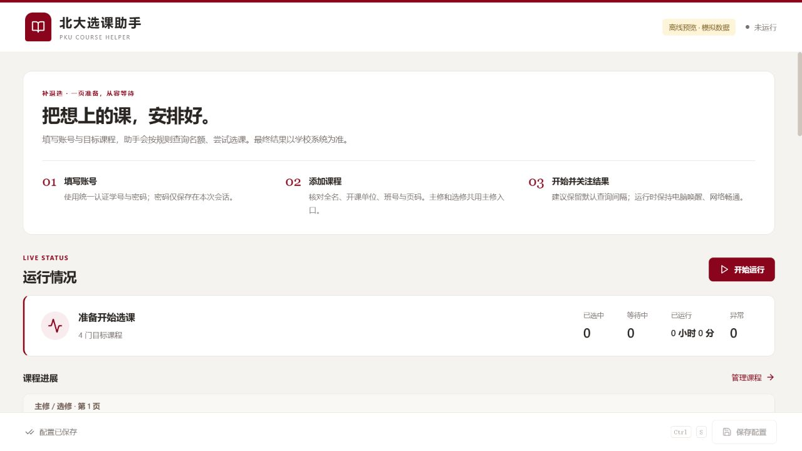

# PKU Course Helper · 北大选课助手

[中文](README.md) | **English**

A Windows tool for course selection during Peking University's add/drop period. One page brings together courses, runtime status and account settings, with major/elective/minor categories, class number `00`, priorities, mutual exclusion, delayed enrollment and logs.



## Usage

Download a ready-to-run package, or clone the repository to run and customize the source.

### Option 1: Download a release package

System requirements: **Windows 10/11 x64**.

1. Open [Release / v1.0.1](https://github.com/Echo-Nie/PKU-Course-Helper/releases/tag/v1.0.1) and download `PKUCourseHelper-windows-x64-portable.zip`.
2. Extract the **entire ZIP** into a writable folder and read the included `使用说明.md`.
3. Double-click `PKUCourseHelper.exe` in the extracted folder. Follow the guide at the top of the app to configure it and get started. Keep `_internal` and all adjacent files; do not copy the EXE alone.

### Option 2: Clone, run and customize the source

Install **Python 3.11 x64**, **Node.js 22** and WebView2. In Git Bash:

```bash
git clone https://github.com/Echo-Nie/PKU-Course-Helper.git
cd PKU-Course-Helper
python -m pip install -r requirements.txt
npm --prefix frontend ci
npm --prefix frontend run build
python desktop.py
```

A virtual environment is optional. Rebuild and restart after frontend changes; restart after Python changes. Existing EXEs need to be rebuilt separately.

For an offline desktop preview, run `python desktop.py --preview`. For a browser preview, run `npm --prefix frontend run dev` and open `http://127.0.0.1:5173/?preview=1`; append `&scenario=errors` for failure examples. Previews use sample data without logging in or enrolling.

### Configure after launching

1. Enter your university account and password. Add courses with the exact name, offering school, class number and page.
2. **主修 (major)** and **选修 (elective)** share the major entry; **辅修 (minor)** uses the minor entry. Pages start at `1`; class numbers `00` and `0` are equivalent and are not the full course identifier.
3. Set priorities within the same entry/page, plus optional mutual exclusion groups or delayed-enrollment thresholds. Save and start.
4. Read the explanation below each status and expand logs for details. Saving changes during a run offers a confirmed restart. Closing the app stops the task.

Keep the default **6-second interval** and **0.2 jitter**, with the computer awake and connected.

## Accounts and local data

- **Local storage, no developer cloud storage:** your student ID, course settings and runtime logs are saved in `data/` within the app folder on your computer. This project does not automatically upload them to the developer or sync them to a developer-operated cloud service.
- **Session-only password:** the current desktop app does not save your password in configuration files; enter it again after restarting. Student IDs and course settings are local files. Do not publicly share `data/`, exported configurations or log screenshots containing personal information.
- **Required university communication:** logging in sends your student ID and password over HTTPS to the university authentication system (`iaaa.pku.edu.cn`). The app also contacts the university enrollment system to query and select courses. Local storage does not mean offline operation or that credentials are never sent to the university.

To migrate settings, close both versions before copying the old `data/` folder into the new app directory.

## Common issues

- Account/password errors: verify university credentials. A combined message is shown when the school does not identify the failing field.
- Course not found: check the entry, page, exact name, school, class number and add/drop plan.
- Minor entry unavailable: confirm the school website provides that entry; use elective for ordinary electives.

## Build an EXE

From the project root in **PowerShell**:

```powershell
.\tools\build_local.ps1
```

Or in **Git Bash**:

```bash
powershell.exe -NoProfile -ExecutionPolicy Bypass -File ./tools/build_local.ps1
```

The script prepares build environments, installs locked dependencies, runs tests, packages the app and performs offline self-tests. Stop the frontend development server before building to release locked files.

The output is `dist/portable/<build-id>/PKUCourseHelper-windows-x64-portable.zip`. Extract it completely before launching the EXE. You can also run the Windows portable workflow manually in GitHub Actions. See [release instructions](docs/RELEASING.md) for other packaging options.

## References and acknowledgments

This project is modified from the following projects, retaining their attribution and MIT license:

- [Aerisun/PKUAutoElective2026](https://github.com/Aerisun/PKUAutoElective2026): the direct foundation, including the desktop app, ONNX inference and multi-identity scheduler.
- [Hovennnnn/PKUAutoElective2023](https://github.com/Hovennnnn/PKUAutoElective2023): earlier adaptations and the captcha recognition model.
- [zhongxinghong/PKUAutoElective](https://github.com/zhongxinghong/PKUAutoElective): the enrollment workflow, school interfaces and selection rules.

Thank you to those who came before us and to all contributors for their accumulated work and willingness to share.

## Usage statement

This project is intended solely for technical learning and exchange. Do not circulate, publicize or promote it on public platforms, in public group chats or other public venues. Follow university rules, avoid disrupting the system, and keep accounts, settings and logs private. Enrollment results are determined by the school system.

These are community usage expectations; code licensing is governed by [LICENSE](LICENSE).
